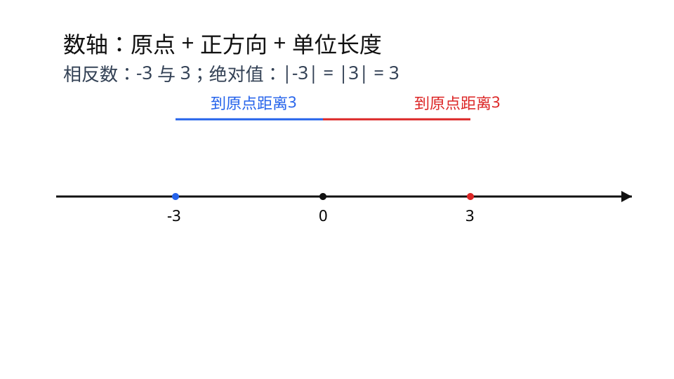

## 第1章 数轴、相反数、绝对值
### 引入
- 本章主题：数轴、相反数、绝对值。
- 学习建议：先掌握“画图和定义”，再做方程和应用题。
- 本章主线：会在数轴上表示有理数、比较大小，并用绝对值解决距离问题。

### 内容
- 定义：
  - 数轴是规定了原点、正方向和单位长度的一条直线。
  - 相反数：若两个数和为0，这两个数互为相反数，如 `3` 与 `-3`。
  - 绝对值：`|a|` 表示数 `a` 到原点的距离，所以绝对值一定非负。

- 数轴画法步骤：
  1. 画一条直线，选一点作原点 `O`。
  2. 规定向右为正方向（或向左为正，但必须事先说明）。
  3. 取统一单位长度并标出刻度。
  4. 按“正数在右、负数在左”描点。
  - 常见错误：同一条数轴上单位长度不一致，会导致大小判断错误。

- 相反数性质：
  - `a` 与 `-a` 在数轴上关于原点对称。
  - `a+(-a)=0`。
  - 只有 `0` 的相反数还是 `0`。

- 绝对值分段定义：

$$|a|=\begin{cases}
a,& a\ge 0 \\
-a,& a<0
\end{cases}$$

- 比较大小方法：
  - 数轴法：右边的数大于左边的数。
  - 代数法：任意正数都大于0，任意负数都小于0，正数大于负数。
  - 绝对值辅助：同号比较绝对值；异号先看正负。

- 作用：
  - 用数轴直观比较大小。
  - 用绝对值表达“距离”（如温差、海拔差、收支差）。

- 小例子：
  - `-2` 在 `0` 左边，所以 `-2<0`；`|-2|=2`。
  - 若 `|x|=4`，则 `x=4` 或 `x=-4`（到原点距离为4有两个点）。

- 易错点：
  - 误区1：把“绝对值”当成“去负号”。
  - 误区2：混淆 `-|a|` 与 `|-a|`（前者一定非正，后者等于 `|a|`）。
  - 误区3：把相反数和倒数混淆（相反数是“和为0”，倒数是“积为1”）。

### 例题
题1（基础）：若 `|x|=5`，求 `x`。
解：到原点距离为5的点有两个，所以 `x=5` 或 `x=-5`。

题2（生活应用）：某天中午温度是 `2°C`，夜间温度是 `-3°C`。这一天昼夜温差是多少？
解题步骤：
1. 温差是“两个温度的距离”，用绝对值表示：

$$\text{温差}=|2-(-3)|$$

2. 先算括号内：`2-(-3)=5`。
3. 再取绝对值：`|5|=5`。
4. 所以昼夜温差是 `5°C`。

### 自测
1. 比较大小：`-3`，`0`，`2`。
2. 若 `x=-4`，写出 `x` 的相反数与绝对值。
3. 解方程：`|x|=7`。
4. 海拔A地为 `-120m`，B地为 `80m`，两地海拔差是多少米？

### 答案
1. `-3<0<2`。
2. 相反数 `4`，绝对值 `4`。
3. `x=7` 或 `x=-7`。
4. `|-120-80|=|-200|=200`，海拔差是 `200m`。

### 学习目标
- 会按步骤画标准数轴并在数轴上表示有理数。
- 理解相反数、绝对值的定义与性质。
- 会用绝对值模型解决简单生活距离问题。

---

