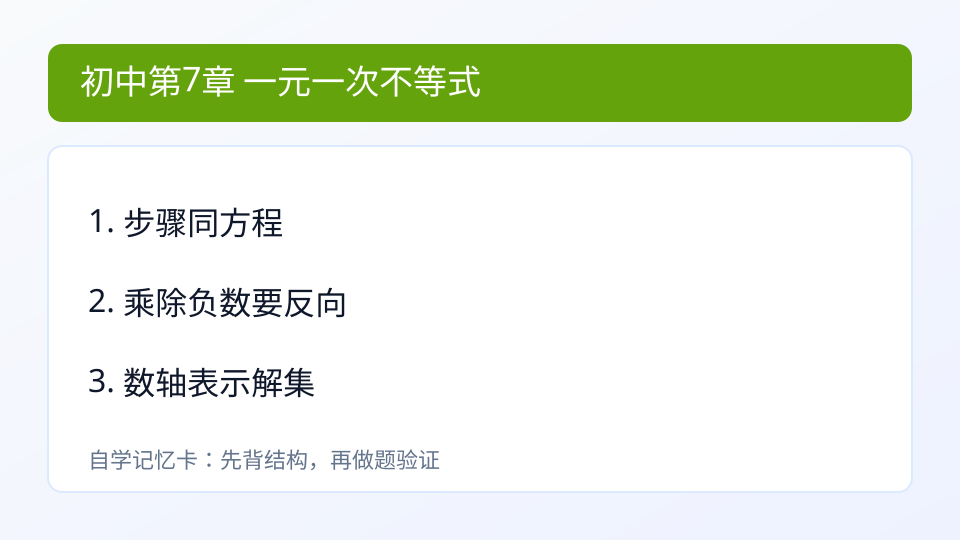

## 第7章 一元一次不等式（组）
### 引入
- 本章主题：一元一次不等式（组）。
- 学习建议：先读“内容”再做“例题与自测”。
- 本章主线：会解不等式并在数轴表示。

### 内容
- 定义：用不等号 > < >= <= 表示大小关系的式子叫不等式。
- 作用：表示“范围”而不只是单个值。
- 关键规则：两边乘或除负数时，不等号方向要改变。
- 小例子：
  - -3x<=6 两边除 -3 得 x>=-2。

### 例题
题：2x-1>3。
解：2x>4，x>2。

### 自测
1. -3x<=6

### 答案
1. x>=-2

---

### 学习目标
- 会解不等式并在数轴表示。

---

