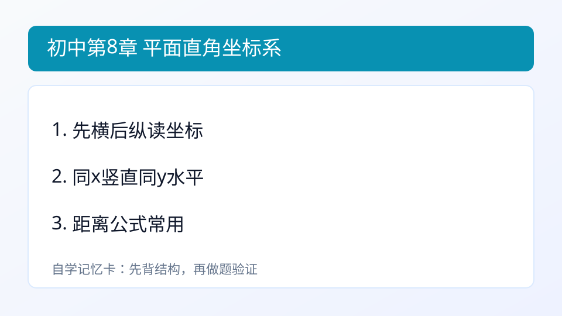
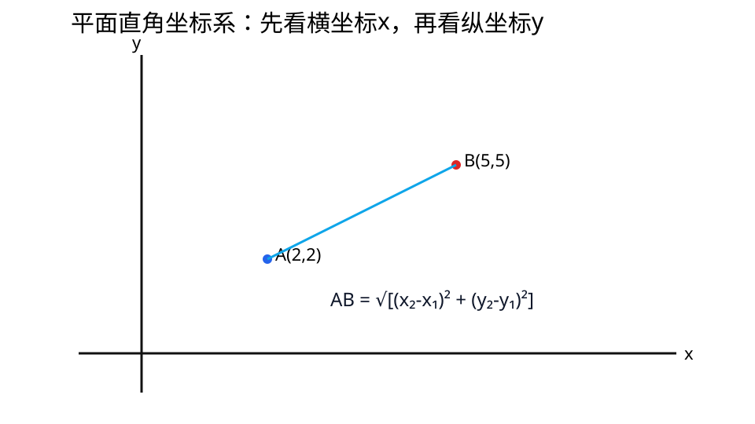

## 第8章 平面直角坐标系
### 引入
- 本章主题：平面直角坐标系。
- 学习建议：先读“内容”再做“例题与自测”。
- 本章主线：会定位点坐标。

### 内容
- 定义：平面直角坐标系由互相垂直的 x 轴和 y 轴组成，点写作 (x,y)。
- 作用：把“图形问题”转成“坐标与代数计算”问题。
- 距离公式（LaTeX）：

$$AB=\sqrt{(x_2-x_1)^2+(y_2-y_1)^2}$$

- 距离公式（纯文本）：AB = √[(x2-x1)^2 + (y2-y1)^2]
- 小例子：
  - A(0,0),B(3,4)，则 AB=5。

### 例题
题：A(1,2),B(4,6)，求AB。
解：AB=√[(4-1)^2+(6-2)^2]=√(9+16)=5。

### 自测
1. A(0,0),B(3,4)

### 答案
1. 5

---

### 学习目标
- 会定位点坐标。
- 会用两点距离公式。

---

