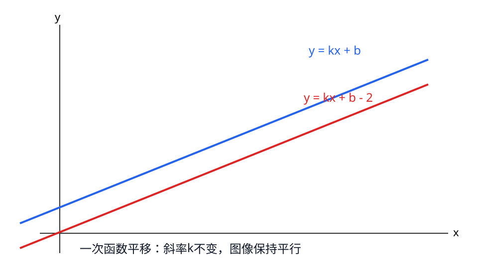

## 第9章 一次函数
### 引入
- 本章主题：一次函数。
- 学习建议：先理解变量与斜率，再做解析式题。
- 本章主线：弄清 `x、y、k、b` 的含义与关系。

### 内容
$$y=kx+b\quad(k\neq 0)$$
- 定义：一次函数是自变量 x 的一次式表达。
- 变量含义：$x$ 是输入量，$y$ 是输出量，$k$ 是斜率，$b$ 是截距。
- 作用：描述“匀速变化/线性关系”。
- 斜率：
$$k=\frac{y_2-y_1}{x_2-x_1}$$
  - k>0 图像上升，k<0 图像下降。
- 小例子：
  - y=2x+1 中，x 每增加1，y 增加2。

### 例题
题：过点 $(0,1)$ 和 $(2,5)$，求一次函数解析式。
解：
1. 先求斜率
$$k=\frac{5-1}{2-0}=2$$
2. 代入点 $(0,1)$ 求 $b$
$$1=2\cdot 0+b\Rightarrow b=1$$
3. 所以解析式为
$$y=2x+1$$

### 自测
1. 在 `y=-3x+2` 中，`x、y、k` 分别是什么量？`k` 是多少？
2. 在 `y=-3x+2` 中，`x` 每增加1，`y` 如何变化？
3. 直线 `y=2x-1` 向上平移3单位后的式子是什么？

### 答案
1. `x` 为自变量，`y` 为因变量，`k=-3`。
2. `y` 每次减少3。
3. `y=2x+2`。

### 学习目标
- 理解变量、自变量、因变量与函数的含义。
- 理解斜率 `k` 的定义、意义和符号性质。
- 会由两点求一次函数解析式并判断图像增减性。

---

