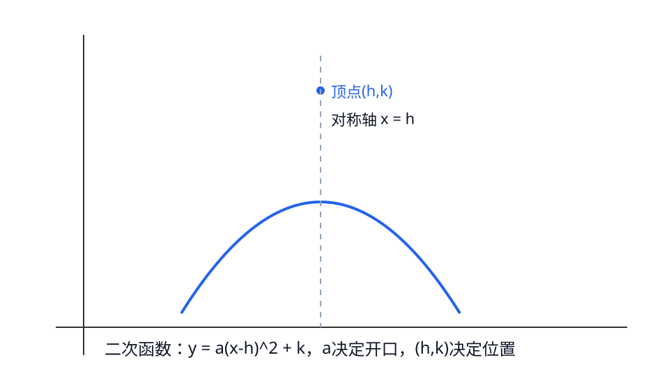

## 第13章 二次函数
### 引入
- 本章主题：二次函数。
- 学习建议：先读“内容”再做“例题与自测”。
- 本章主线：理解抛物线开口、顶点、对称轴。

### 内容
$$y=a(x-h)^2+k$$
- 定义：二次函数图像是抛物线。
- 作用：描述“先增后减/先减后增”的变化规律与最值。
- 性质：
  - 顶点 $(h,k)$，对称轴 $x=h$。
  - $a>0$ 开口向上，$a<0$ 开口向下。
- 小例子：
  - $y=(x-1)^2+2$ 顶点是 $(1,2)$。

### 例题
题：y=(x-1)^2+2 顶点是？
解：顶点(1,2)。

### 自测
1. y=-2(x+3)^2-1 开口方向？

### 答案
1. 向下

---

### 学习目标
- 理解抛物线开口、顶点、对称轴。

---

