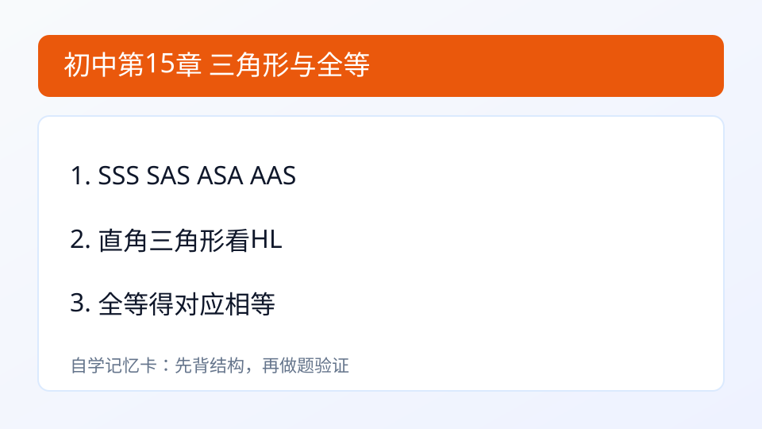

## 第15章 三角形与全等
### 引入
- 本章主题：三角形与全等。
- 学习建议：先读“内容”再做“例题与自测”。
- 本章主线：掌握SSS、SAS、ASA/AAS、HL。

### 内容
- 定义：两个三角形形状和大小完全相同，叫全等三角形。
- 作用：通过“全等”把未知边角转成已知边角。
- 判定：SSS、SAS、ASA/AAS，直角三角形可用 HL。
- 小例子：
  - 两边及夹角对应相等，可判 SAS 全等。

### 例题
题：已知两边及夹角对应相等，可判什么？
解：两三角形全等（SAS）。

### 自测
1. 直角三角形可用什么特殊判定？

### 答案
1. HL

---

### 学习目标
- 掌握SSS、SAS、ASA/AAS、HL。

---

