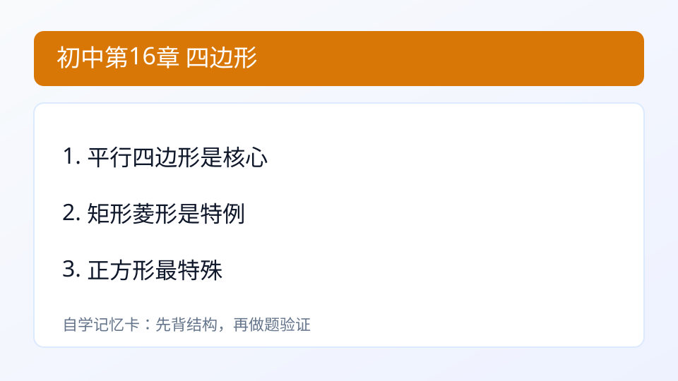

## 第16章 四边形
### 引入
- 本章主题：四边形。
- 学习建议：先读“内容”再做“例题与自测”。
- 本章主线：理解平行四边形、矩形、菱形、正方形性质。

### 内容
- 定义：四边形中，平行四边形是基础模型，矩形/菱形/正方形是其特殊情形。
- 作用：利用对边、对角、对角线性质快速求解。
- 典型性质：
  - 平行四边形：对边平行且相等，对角相等，对角线互相平分。
- 小例子：
  - 平行四边形邻角互补，若一角 70°，邻角 110°。

### 例题
题：平行四边形一组邻角为70°，另一邻角为？
解：110°。

### 自测
1. 矩形对角线有何关系？

### 答案
1. 相等且互相平分

---

### 学习目标
- 理解平行四边形、矩形、菱形、正方形性质。

---

