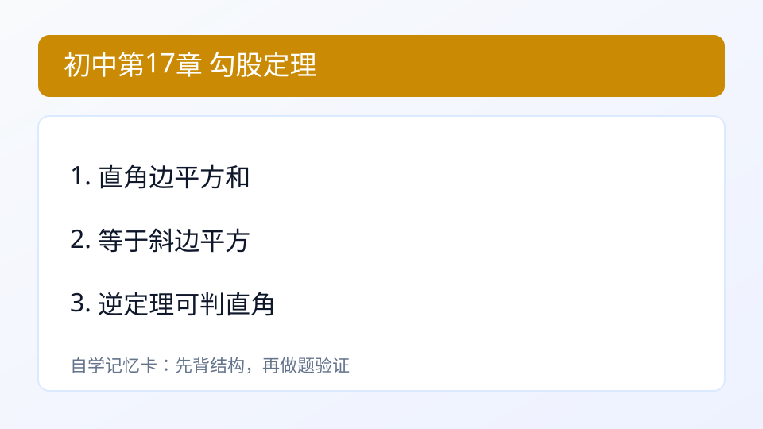
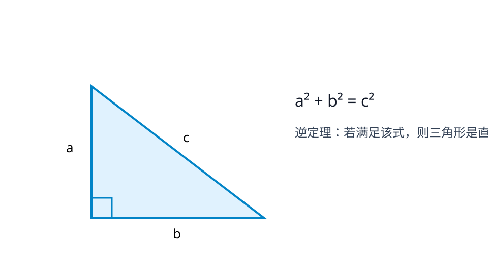

## 第17章 勾股定理
### 引入
- 本章主题：勾股定理。
- 学习建议：先读“内容”再做“例题与自测”。
- 本章主线：会用勾股定理及逆定理。

### 内容
$$a^2+b^2=c^2$$
- 定义：在直角三角形中，两直角边平方和等于斜边平方。
- 作用：由两边求第三边，或判定是否直角三角形（逆定理）。
- 小例子：
  - 边长 3,4,5 满足 3^2+4^2=5^2，是直角三角形。

### 例题
题：直角三角形两直角边3,4，斜边？
解：5。

### 自测
1. 三边6,8,10是否直角三角形？

### 答案
1. 是

---

### 学习目标
- 会用勾股定理及逆定理。

---

