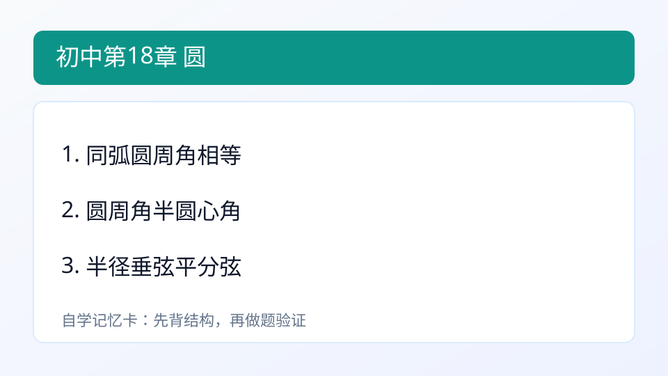
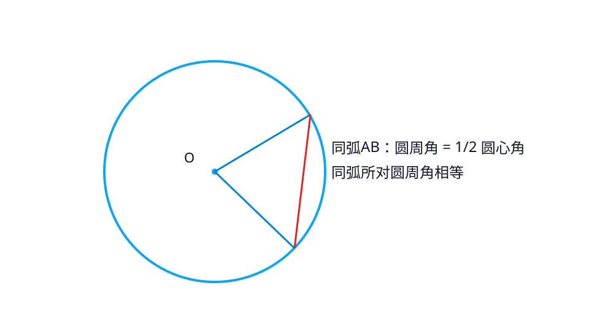

## 第18章 圆
### 引入
- 本章主题：圆。
- 学习建议：先读“内容”再做“例题与自测”。
- 本章主线：理解圆周角定理等基础结论。

### 内容
- 定义：圆是到定点（圆心）距离等于定长（半径）的点的集合。
- 作用：统一处理弧、角、弦之间关系。
- 性质：
  - 同弧所对圆周角相等。
  - 圆周角等于同弧圆心角的一半。
- 小例子：
  - 圆心角 80°，对应圆周角 40°。

### 例题
题：圆心角80°，对应圆周角？
解：40°。

### 自测
1. 同弧所对圆周角关系？

### 答案
1. 相等

---

### 学习目标
- 理解圆周角定理等基础结论。

---

