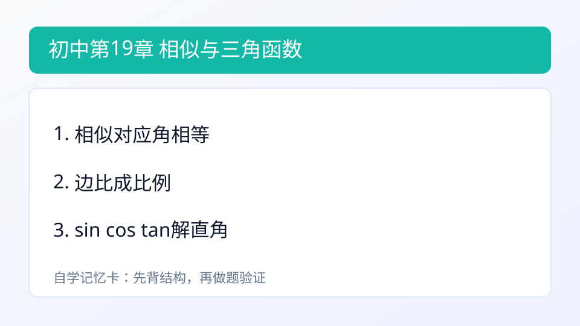
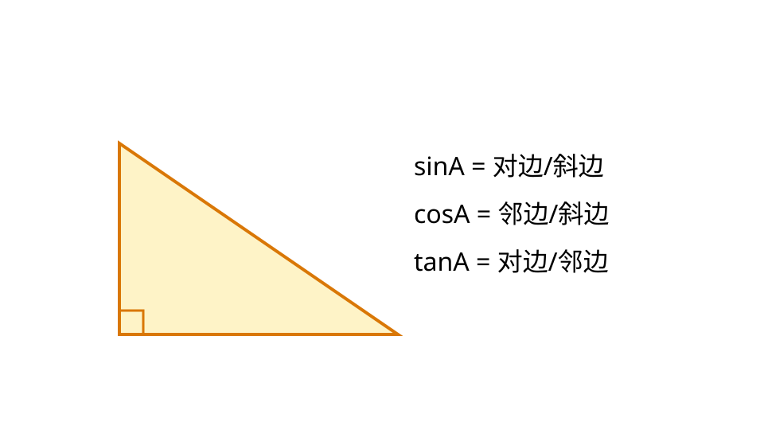

## 第19章 相似与锐角三角函数
### 引入
- 本章主题：相似与锐角三角函数。
- 学习建议：先读“内容”再做“例题与自测”。
- 本章主线：会判定相似三角形。

### 内容
- 定义：相似三角形是形状相同、大小可不同的三角形；对应角相等、对应边成比例。
- 作用：把未知长度转成比例计算；三角函数用于直角三角形边角互求。
- 公式：
$$\sin A=\frac{\text{对边}}{\text{斜边}},\quad \cos A=\frac{\text{邻边}}{\text{斜边}},\quad \tan A=\frac{\text{对边}}{\text{邻边}}$$
- 小例子：
  - 若 $\sin A=\frac{3}{5}$ 且斜边为10，则对边为6。

### 例题
题：直角三角形中，sinA=3/5，斜边10，对边？
解：对边=6。

### 自测
1. 相似三角形对应角关系？

### 答案
1. 对应角相等

---

### 学习目标
- 会判定相似三角形。
- 会用sin、cos、tan解直角三角形。

---

