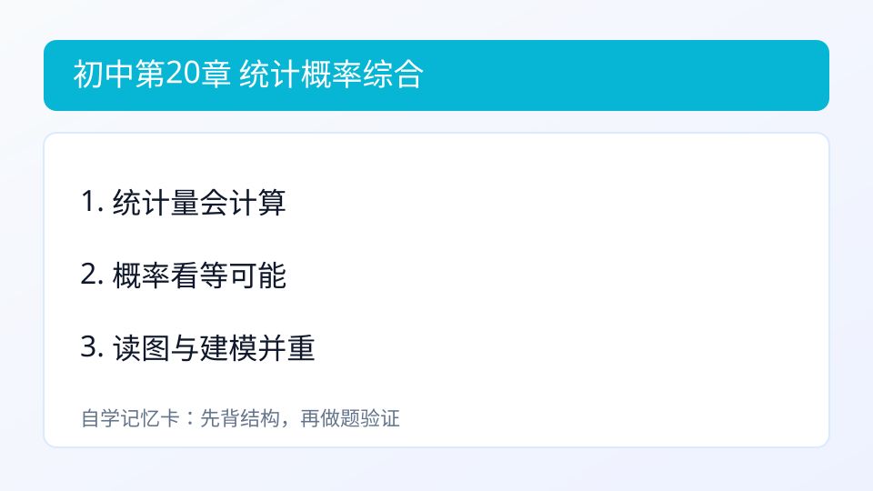

## 第20章 统计、概率与中考综合
### 引入
- 本章主题：统计、概率与中考综合。
- 学习建议：先理解统计量含义，再做概率题。
- 本章主线：掌握平均数、中位数、众数、频率与概率基础。

### 内容
- 定义：
  - 统计用于描述数据特征（平均数、中位数、众数、方差等）。
  - 概率用于描述事件发生的可能性。
- 作用：从数据中提取规律，支持预测与决策。
- 基本模型：
  - 等可能情况下，`P(事件)=\frac{有利结果数}{总结果数}`。
- 小例子：
  - 掷均匀骰子，出现偶数概率 `=\frac{3}{6}=\frac{1}{2}`。

### 例题
题：掷一枚均匀骰子，点数为偶数概率？
解：3/6=1/2。

### 自测
1. 数据1,2,2,4 的众数与平均数。

### 答案
1. 众数2，平均数2.25。

### 学习目标
- 理解统计量（平均数、中位数、众数）的意义。
- 会计算等可能模型下的简单概率。
- 能把统计和概率方法用于综合题分析。

---

